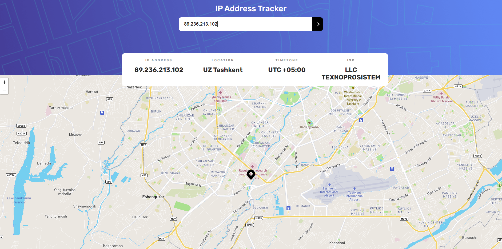
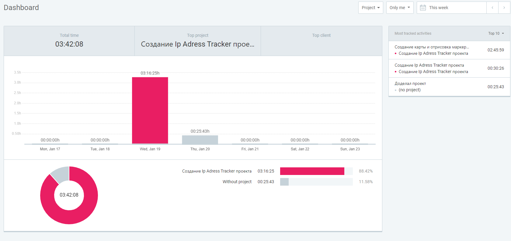
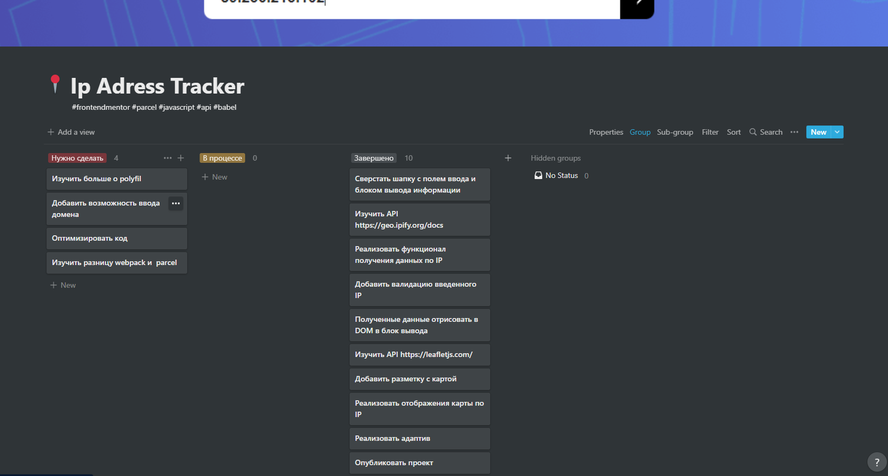

# Frontend Mentor - решение для отслеживания IP-адресов

Это решение [проблемы отслеживания IP-адресов на Frontend Mentor] (https://www.frontendmentor.io/challenges/ip-address-tracker-I8-0yYAH0). Испытания Frontend Mentor помогут вам улучшить свои навыки программирования, создавая реалистичные проекты.

## Оглавление

- [Обзор](#обзор)
  - [Вызов](#вызов)
  - [Скриншот](#снимок-экрана)
  - [Ссылки](#ссылки)
- [Мой процесс](#мой-процесс)
  - [Построено с помощью](#построено-с-помощью)
  - [Что я выучил](#что-я-выучил)
  - [Продолжение разработки](#продолжение-разработки)
  - [Время на написания проекта](#Время-на-написания-проекта)
  - [Доска Kanban](#Доска-Kanban)
  - [Полезные ресурсы](#полезные-ресурсы)
- [Автор](#автор)
- [Благодарность](#благодарность)

**Примечание. Удалите это примечание и обновите оглавление в зависимости от того, какие разделы вы сохранили.**

## Обзор

### Соревнование

Пользователи должны иметь возможность:

- Просмотр оптимального макета для каждой страницы в зависимости от размера экрана их устройства
- Просматривайте состояния наведения для всех интерактивных элементов на странице.
- Увидеть собственный IP-адрес на карте при начальной загрузке страницы
- Поиск любых IP-адресов или доменов и просмотр ключевой информации и местоположения

### Снимок экрана



### Ссылки

- URL-адрес решения: [github] (https://github.com/Ibrakhimzhanov/ipTracker)
- URL-адрес активного сайта: [vercel] (https://ipfind-mauve.vercel.app/)

## Мой процесс

### Построено с помощью

- Семантическая разметка HTML5
- Методология БЭМ
- Leaflet
- Пользовательские свойства CSS
- FlexBox
- CSS-сетка

### Что я выучил

Я научился работать с многими технологиями в том числе и с parcel, babel
В написании html семантики использовал методологию БЭМ. Так же,чтобы проект был чище было мною принято решения использовать модули и разносить на разные модули.

```html
<h1 class="title">IP Address Tracker</h1>
<div class="search-bar">
  <input
    type="text"
    class="search-bar__input"
    placeholder="Search for any IP address or domain"
  />
  <button class="search-bar__btn"></button>
</div>
<div class="info">
  <div class="info__block">
    <div class="info__block-subtitle">IP Address</div>
    <div class="info__block-title" id="ip"></div>
  </div>
</div>
```

```CSS
  .search-bar__btn::after {
  border-color: white white transparent transparent;
  transform: rotate(45deg);
}

```

```js
function setInfo(mapData) {
  const { lat, lng, country, region, timezone } = mapData.location;
  ipInfo.innerText = mapData.ip;
  locationInfo.innerText = country + " " + region;
  timeZoneInfo.innerText = timezone;
  ispInfo.innerText = mapData.isp;

  map.setView([lat, lng]);
  L.marker([lat, lng], { icon: markerIcon }).addTo(map);
  if (matchMedia("(max-width: 1023px)").matches) {
    addOffset(map);
  }
}
```

### Продолжение разработки

Дальше я хочу продолжить работу вместе с API, так же поработать с сборщиком WebPack и дальше хочу добавить в проект возможность находить по местоположению. И добавить функцию работы не только по IP адресу, но и по домену.

### Время на написания проекта

- (не включая css и html)



### Доска Kanban

Я использовал доску канбан, чтобы проще было ориентироваться в поставленных задачах. Я как и в предыдущем проекте использовал [Notion](https://ibrakhimzhanov.notion.site/cc1898a503f84f51a7bf628c932e8998?v=be886ce151954f9a80aa1a554426939d)



### Полезные ресурсы

- [Изменено структура parcel] (https://parceljs.org/getting-started/migration/) - Структура parcel немного изменилась, со временем последнего использования. Документация очень помогла мне решить мою задачу.
- [Решение проблемы с deploy в vercel] (https://www.youtube.com/watch?v=E_n-jPGniCI&ab_channel=Webtime.Studio) - Я очень долго копался в запуске своего приложения, это видео помогло мне запустить свое приложения vercel

## Автор

- Мой блок на hashnode- [Ibrakhimzhanov Islam] (https://middleit.hashnode.dev/)
- Frontend Mentor - [@Ibrakhimzhanov](https://www.frontendmentor.io/profile/Ibrakhimzhanov)
- Linkedin - [@Ibrakhimzhanov](https://www.linkedin.com/in/ibrakhimzhanov/)

## Благодарность

Спасибо моему ментору по разработке Михаилу, за помощь в реализации и за терпения научить меня чему-то😊
